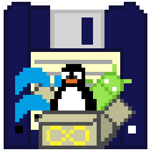

<p align="center">
  
</p>

<p align="center">
  
</p>

<p align="center">
  
  
  
  
</p>

---

**System Save Eternal (SSE)** é um sistema inteligente de backup e versionamento de saves de jogos que roda diretamente no terminal. Ele **detecta automaticamente seu sistema operacional** (Linux ou Windows), localiza seus saves do Minecraft e Pokémon Nintendo DS, oferece seleção interativa e envia para **múltiplos destinos simultaneamente** — GitHub, Google Drive e Telegram.

---

## 🔥 Destaques

- 🎮 **Minecraft** — Detecta automaticamente todos os mundos, independente do launcher
- 🐉 **Pokémon DS** — Varre emuladores e o sistema inteiro atrás de saves
- 🚀 **Modo Jogar** — Abre o launcher, monitora o processo, sincroniza antes e depois
- ☁️ **3 Destinos Simultâneos** — GitHub, Google Drive e Telegram de uma só vez
- 🔐 **GitHub guiado** — Pergunta se já tem repo ou guia passo a passo para criar um **privado**
- 🧩 **Multi-plataforma** — Código único que se adapta automaticamente ao SO
- 🖥️ **Terminal interativo** — Menus, checkboxes e feedback visual com cores

---

## 📦 Instalação

### 🐧 Linux

```bash
# Clone
git clone https://github.com/DevFalconszz/System-Save-Eternal-SSE.git
cd System-Save-Eternal-SSE

# Virtualenv (recomendado)
python3 -m venv venv
source venv/bin/activate

# Dependências
pip install -r requirements.txt

# Execute
python3 src/main.py
```

> 💡 **Atalho:** `chmod +x src/main.py && ln -s "$(pwd)/src/main.py" ~/.local/bin/sse`

### 🪟 Windows

```powershell
:: Clone
git clone https://github.com/DevFalconszz/System-Save-Eternal-SSE.git
cd System-Save-Eternal-SSE

:: Virtualenv (recomendado)
python -m venv venv
venv\Scripts\activate

:: Dependências
pip install -r requirements.txt

:: Execute (duplo clique ou terminal)
python src\main.py
:: ou
sse.bat
```

---

## 🎮 Modos de Uso

### Opção 1: Backup de Saves

Fluxo tradicional: escolhe o jogo, seleciona os saves, escolhe os destinos e faz o backup.

```
[1] Fazer backup de saves
    │
    ├─ Minecraft → lista mundos de ~/.minecraft/saves/
    │              (ou %APPDATA%\.minecraft\saves\ no Windows)
    │
    └─ Pokémon  → varre emuladores (DeSmuME, MelonDS, RetroArch, mGBA, No$GBA)
                   + varredura no sistema inteiro
```

### Opção 2: Jogar Minecraft com Sincronização Automática

Fluxo completo: detecta o launcher, puxa saves do GitHub, abre o jogo, monitora, e salva tudo ao fechar.

```
[2] Jogar Minecraft com sincronização automática
    │
    ├─ 1. Detecta launcher instalado
    │     (SKLauncher, Prism, MultiMC, Vanilla, ATLauncher...)
    │
    ├─ 2. Pull dos saves do GitHub
    ├─ 3. Rsync saves → launcher
    ├─ 4. Abre o jogo 🎮
    ├─ 5. Monitora o processo
    ├─ 6. Quando fecha → rsync → repositório local
    ├─ 7. Git push para GitHub
    └─ 8. Opcional: backup extra (Drive / Telegram)
```

---

## 🎮 Games Suportados

### ⛏ Minecraft

Detecta automaticamente os diretórios de saves conforme o SO:

| Sistema | Localizações buscadas |
|---------|----------------------|
| **Linux** | `~/.minecraft/saves/`, `~/.local/share/minecraft/saves/`, `~/snap/minecraft/common/.minecraft/saves/` |
| **Windows** | `%APPDATA%\.minecraft\saves\`, `%USERPROFILE%\.minecraft\saves\` |

O sistema identifica mundos pelo arquivo `level.dat`, exibe nome, tamanho e caminho, e você seleciona quantos quiser.

#### Launchers Detectados Automaticamente

| Launcher | Linux | Windows |
|----------|-------|---------|
| **SKLauncher** | ✅ `sklauncher` / `SKLauncher.jar` | ✅ `SKLauncher.exe` |
| **Prism Launcher** | ✅ `prismlauncher` | ✅ `PrismLauncher.exe` |
| **MultiMC** | ✅ `multimc` | ✅ `MultiMC.exe` |
| **Minecraft Launcher** | ✅ `minecraft-launcher` | ✅ `MinecraftLauncher.exe` |
| **ATLauncher** | ✅ `ATLauncher` | ✅ `ATLauncher.exe` |
| **GDLauncher** | ✅ `gdlauncher` | ✅ `GDLauncher.exe` |
| **CurseForge** | ✅ `curseforge` | ✅ `CurseForge.exe` |

Se o launcher não for detectado, o SSE oferece **configuração manual** (caminho do binário + diretório do jogo).

### 🐉 Pokémon (Black & White / DS)

Busca inteligente por saves de emuladores Nintendo DS:

| Emulador | Extensões | Linux | Windows |
|----------|-----------|-------|---------|
| **DeSmuME** | `.dsv`, `.sav` | `~/.config/desmume/` | `%APPDATA%\DeSmuME\` |
| **MelonDS** | `.sav`, `.dsv` | `~/.local/share/melonDS/` | `%APPDATA%\melonDS\` |
| **RetroArch** | `.sav`, `.dsv`, `.state` | `~/.config/retroarch/saves/` | `%APPDATA%\RetroArch\saves\` |
| **No$GBA** | `.sav` | — | `%USERPROFILE%\.no$gba\` |
| **mGBA** | `.sav` | `~/.config/mgba/` | `%APPDATA%\mgba\` |

Se nada for encontrado, faz varredura em todo o sistema:
- **Linux:** `/home`, `/mnt`, `/media`
- **Windows:** `C:\Users`, `D:\`, `E:\`

---

## ☁️ Destinos de Backup

Você seleciona **múltiplos destinos ao mesmo tempo** com checkboxes:

```
[✓] GitHub
[✓] Google Drive
[ ] Telegram
```

### GitHub

`git add + commit + push` para seu repositório **privado** de saves.

**Configuração guiada:**

1. **Já tem repositório?** Informe a URL
2. **Não tem?** O SSE exibe o passo a passo:
   - Acesse `https://github.com/new`
   - Crie repositório **PRIVADO** (sem README)
   - Cole a URL gerada
3. **Token de acesso:** Guia para criar em:
   `Settings → Developer Settings → Personal Access Tokens → Tokens (classic)`
   Escopo: **`repo`** (controle total)

### Google Drive

Upload via `pydrive2`. Setup: Google Cloud Console → Habilitar Google Drive API → Credenciais OAuth 2.0 (Desktop app).

### Telegram

Upload via [Telethon](https://github.com/LonamiWebs/Telethon) para **Saved Messages**. Setup: [my.telegram.org](https://my.telegram.org) → API Development Tools.

---

## 🏗️ Arquitetura

Dois repositórios trabalham juntos:

```
┌──────────────────────────────────────────────────┐
│  📦 System-Save-Eternal-SSE (PÚBLICO)             │
│  ├── src/           → Código do sistema          │
│  ├── config.json    → Suas configurações          │
│  └── README.md      → Documentação               │
│  Função: Gerenciar os backups                    │
└──────────────┬───────────────────────────────────┘
               │ git push / Google Drive / Telegram
               ▼
┌──────────────────────────────────────────────────┐
│  🔒 System-Save-Eternal (PRIVADO)                 │
│  ├── Minecraft/   → Saves, mods, config          │
│  ├── Pokemon-Black-White/ → Saves, ROM           │
│  └── .git/        → Histórico versionado         │
│  Função: Armazenar os saves                      │
└──────────────────────────────────────────────────┘
```

---

## 📁 Estrutura do Projeto

```
System-Save-Eternal-SSE/
├── src/
│   ├── main.py                  # Entry point
│   ├── console/
│   │   └── menu.py              # Interface de terminal
│   ├── games/
│   │   ├── base.py              # Classe abstrata GameFinder
│   │   ├── minecraft.py         # Detecção de saves Minecraft (auto SO)
│   │   └── pokemon.py           # Detecção de saves Pokémon (auto SO)
│   ├── launcher/
│   │   └── minecraft_launcher.py # Detecção + monitoramento de launcher
│   ├── savers/
│   │   ├── base.py              # Classe abstrata Saver
│   │   ├── github_saver.py      # Backup via GitHub
│   │   ├── googledrive_saver.py # Backup via Google Drive
│   │   └── telegram_saver.py    # Backup via Telegram
│   └── utils/
│       ├── file_utils.py        # Utilitários de busca (auto SO)
│       └── config.py            # Gerenciamento de config
├── sse.bat                      # Atalho Windows
├── config.example.json          # Template de configuração
├── requirements.txt             # Dependências
├── icoico.png                   # Ícone do projeto
├── SYSTEM-SAVE-ETERNAL-SSE.png  # Banner do projeto
└── README.md                   # Documentação
```

---

## 🧪 Fluxo de Uso Completo

```
┌─────────────────────────────────────────────────────────┐
│  python3 src/main.py  (Linux)                           │
│  python src\main.py   (Windows)                         │
├─────────────────────────────────────────────────────────┤
│                                                         │
│  O que deseja fazer?                                    │
│                                                         │
│  [1] Fazer backup de saves                              │
│      ├─ Minecraft  → seleciona mundo(s)                 │
│      └─ Pokémon    → seleciona save(s)                  │
│                                                         │
│  [2] Jogar Minecraft com sincronização automática       │
│      ├─ Detecta launcher → pull → abre jogo → monitora  │
│      └─ Fechou → push automático                        │
│                                                         │
│  Destinos (checkboxes):                                 │
│  [✓] GitHub    [ ] Google Drive    [✓] Telegram         │
│                                                         │
│  ✅ Backup concluído!                                   │
└─────────────────────────────────────────────────────────┘
```

---

## 🛠️ Tecnologias

| Tecnologia | Versão | Uso |
|------------|--------|-----|
| Python | 3.8+ | Linguagem principal |
| Colorama | 0.4+ | Cores no terminal |
| GitPython | 3.1+ | Operações Git |
| PyDrive2 | 1.19+ | Google Drive API |
| Telethon | 1.35+ | Telegram MTProto |

---

## 🤝 Contribuição

```bash
git checkout -b feature/nova-feature
git commit -m "feat: descrição clara"
git push origin feature/nova-feature
```

Abra um **Pull Request** para a branch `main`.

---

## 📄 Licença

MIT

---

<p align="center">
  
</p>
<p align="center">
  <sub>Feito com 💾 para preservar o que importa.</sub>
</p>
